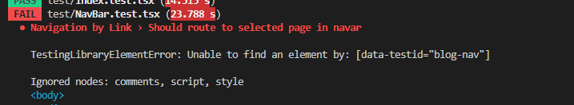
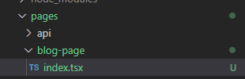
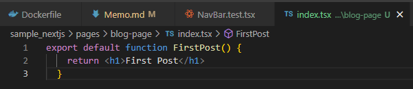
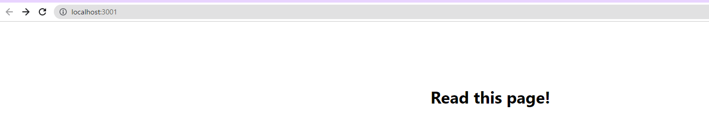
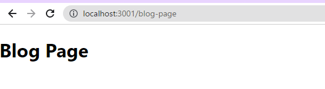
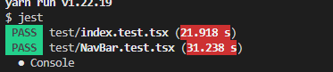

# next.jsの画面遷移とテスト
## テスト
  - https://qiita.com/suzu1997/items/e4ee2fc1f52fbf505481#%EF%B8%8E%E3%83%9A%E3%83%BC%E3%82%B8%E9%81%B7%E7%A7%BB%E3%81%AE%E3%83%86%E3%82%B9%E3%83%88
  - yarn add next-page-tester
  - NavBar.test.tsx
  - いやまずテスト動かないんだが・・・
    - https://qiita.com/Domao/items/fdd982ec9b8b7d095eda
  - 動いた
  - 
## 画面遷移の実装
  - まず画面の実装
    - pagesフォルダに必要な画面用のtsファイル追加
    - 
    - 
  - 画面への遷移実装
    - やることはLink追加するのみ
  ~~~
            <Link href="/blog-page" data-testid='blog-nav'
              className='text-gray-300 hover:bg-gray-700 px-3 py-2 rounded'>
            this page!
          </Link>
  ~~~
  - 無事ページに飛ぶように
  - 
  - 
  - TESTも通りました
  - 