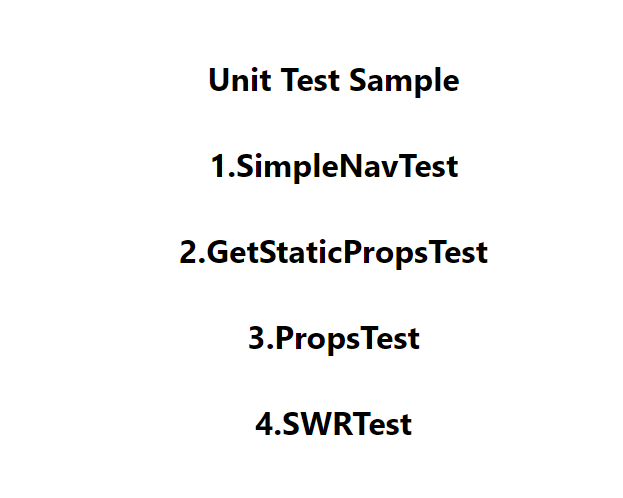
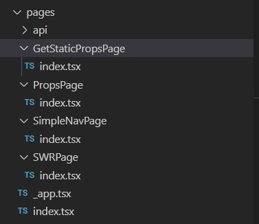

# やったこと
- next.jsの基本機能のサンプル実装
- それぞれの基本機能について、それを満たすかどうか検査するUnitTestを実装
# 対象とした機能
- テキストのレンダリング 
- ページ遷移
- getStaticProps
- Props
- CSR

# UnitTestについて
- ライブラリとしてはJestを利用。
  - Javascriptのテストフレームワーク
  - 各クライアントのページ・コンポーネントをテスト用に描写し、期待値通りの描写がされているかどうかを機械的に試験する

# そもそもnext.jsとは？
- Reactに類似したWebアプリケーションフレームワーク
- Reactがクライアントサイドでのレンダリングに特化しているのに対し、サーバーサイドレンダリングも組み合わせてよりパフォーマンスの高いサイト開発が可能
- 今回は、実装を(ほぼ)TypeScriptで実装

# 試した機能とUnitTest
## 0.テキストレンダリング
### 概要
　
  - next.jsでは、デフォルトでサーバーサイドレンダリング (Pre-rendering)を行っている
    - ページのソースにサーバー側のJavascriptで実行された結果のhtmlがそのまま記載されている
### テスト
   - 該当のページをレンダリングし、期待値のTextが描写しているかどうか検証
~~~

describe('Home', () => {
  it('0.HomePageRenderingTest', () => {
    render(<Home />)
    expect(screen.getByText('Unit Test Sample')).toBeInTheDocument()
  })
})
~~~

## 1.ページ遷移
### 概要
- Next.jsはページのルーティングが非常に楽 (フォルダ階層がそのままページ階層となる)
- 
- ページ遷移は、用意されているLink部品を使うだけ
~~~
      <h1 className="title">
          <Link href="/SimpleNavPage" data-testid='nav-test'
         className='text-gray-300 hover:bg-gray-700 px-3 py-2 rounded'>
            1.SimpleNavTest
          </Link>
        </h1>
~~~
### TEST
  - 該当のLinkに対してIDを振っておき、それをクリックする
  - ページ遷移するので、期待通りのTextが描写されているか
~~~
 
 // Linkタグに対するページ遷移のテストを実施
 // describe でテストタイトルを設定
 describe('1.Navigation by Link', () => {
   // next-page-testerを使うには、関数をasyncにする
   it('Should route to selected page in navar', async () => {
     const { page } = await getPage({
       route: '/index', // 取得したいページのパス
     });
     render(page); // HTMLの構造を取得
 
     // getByTestIdでテストIDを取得し、それに対しクリックのシミュレーションを実施
     userEvent.click(screen.getByTestId('nav-test'));
     // 非同期の場合は、findByTextでテキストを検索
     expect(await screen.findByText('1.SimpleNavPage')).toBeInTheDocument();
   });
 });
~~~

## 2.GetStaticProps 
### 概要
- いわゆるSSG.　ビルド時にあらかじめサーバーからデータを取得しておき、htmlファイルのレンダリングを行う
- 実装は、ページファイル内に"GetStaticProps"というメソッドを追加し、内部でhtmlの取得処理を実装しておくだけ
  - コンパイル時に自動的にレンダリングされる
~~~
export const getStaticProps: GetStaticProps = async ({
	params,
  }: GetStaticPropsContext) => {
	const res=await fetch("https://jsonplaceholder.typicode.com/users")
	const users=await res.json()
	const user = users[0]
	return {
	  props: {
		id: user.id,
		name: user.username,
		email: user.email,
	  },
	};
  };
~~~
### TEST
- jestのtestlibraryが提供しているMock Service Worker(msw)を利用
- 本来、APIを実行する処理が多いがTEST段階のため通信はさせたくない
  - ダミーでMockを用意しておく
  - 具体的には、ネットワークレベル(URL)で介入を行い、実際の通信を行うのではなくダミーのjsonを返すようにする
  - 下記は、'https://jsonplaceholder.typicode.com/users'に対するリクエストに対してダミーのjsonを返す
~~~
    rest.get(
      'https://jsonplaceholder.typicode.com/users',
      (req, res, ctx) => {
        return res(
          // 以下はダミーデータ
          ctx.status(200),
          ctx.json([
            {
              userId: 1,
              id: 1,
              username: 'dummyname1',
              email: 'dummy@dummy.com',
            },
            {
              userId: 2,
              id: 2,
              username: 'dummyname2',
              email: 'dummy@dummy.com',
            },
          ]),
        );
      },
~~~

## 3.Component
### 概要
- いわゆる「部品」。next.jsではjavascript(TypeScript)の単位でフロントエンド部品を実装できる
- 部品に対してpropsというプロパティを渡すことで、レンダリング時に必要な情報を連携可能
- (下記は思いっきりサボってjsで書いてます。。。)
~~~
function News(props) {
    return (
      

        <ul>
          {props.news.map((item) => {
            return (
              <li>
                {item.id}:{item.title}:{item.content}
              </li>
            );
          })}
        </ul>
      

    );
  }
~~~

### TEST
- コンポーネント単位で、レンダリングとテストが可能
- propsとしてはダミーのものを引き渡しておく
~~~
 describe('Post component with given props', () => { 
 
  // ダミーのpropsを定義
   let dummyProps:any;
   beforeEach(() => {
     dummyProps = [
        {
          id: "1",
          title: "test1",
          content: "texttext1",
        },
        {
          id: "2",
          title: "test2",
          content: "texttext2",
        },
      ];
   });
 
   it('Should render correctly with given props value', () => {
 　 // ダミーのpropsを渡してコンポーネントをレンダー
     render(<News news = {dummyProps} />);
     expect(screen.getByText("1:test1:texttext1")).toBeInTheDocument();
     expect(screen.getByText("2:test2:texttext2")).toBeInTheDocument();
   });
 }); 
~~~ 

## 4.SWR
### 概要
- SSGではなく、レスポンス性を求めてクライアントサイドレンダリング(CSR)を利用する場合、通信が非同期になるため状態制御が必要になる
- 例：
  - 通信が完了するまでに何を描写するか？ (Loading?)
  - 通信が完了後にどう切り替えるか？
  - 通信が万が一失敗した場合はどうするか？
- ここら辺の制御をうまくやってくれるライブラリの一つに、SWRがある
- SWR
  - 上記の通り、クライアントにおけるデータ取得時の状態管理をしやすいようにするライブラリ
  - 非同期でデータ取得する「fetcher」を用意してあげると、後は自動的にポーリングすることでデータの自動フェッチや画面の再描写が可能
~~~
// swrはこういったfetcherが必要
const fetcher = (...args) => fetch(...args).then((res) => res.json())

function App() {
  // useStateを利用する感覚で記述
  const { data, error } = useSWR('https://jsonplaceholder.typicode.com/todos/', fetcher)

  // データに応じた処理
  if (error) return 
Error!

  if (!data) return 
loading...

  console.log('data', error)

  return (
    

      success!!
       
      <ul>
          {data.map((item) => {
            return (
              <li>
                {item.id}:{item.title}
              </li>
            );
          })}
        </ul>
    

  )
}
~~~
### TEST
- ほぼSSGのときと内容は同じ
~~~
   // Success時
    it('Should render the value fetched by useSWR', async () => {
      render(
        // useSWRの機能もテストしたい場合は、SWRConfigでラップ
        // dedupingIntervalを0にすることで、useSWRのデータをキャッシュしないようにする
        <SWRConfig value={{ dedupingInterval: 0 }}>
          <ToDo />
        </SWRConfig>,
      );
      expect(await screen.findByText('1:dummy body A'));
      expect(screen.getByText('2:dummy body B'));
    });
~~~
- エラーのときもテストしたい場合は、MockServerの内容を書き換えて強制的に400エラーを返すような状態にしたうえでテストができる
~~~
   // Error発生時
    it('Should render Error text when fetch failed', async () => {
      // エラー用にモックサーバの上書き
      server.use(
        rest.get(
            'https://jsonplaceholder.typicode.com/todos/',  
          (req, res, ctx) => {
            return res(ctx.status(400));
          },
        ),
      );
      render(
        <SWRConfig value={{ dedupingInterval: 0 }}>
          <ToDo />
        </SWRConfig>,
      );
      expect(await screen.findByText('Error!'));
      screen.debug();
    });
~~~

# まとめ
- フロントエンド側実装の基礎の基礎部分、およびそれに対するUnitTestを実装
- 特にフロントエンドにおけるUnitTestは、Seleniumに代表されるE2ETest (画面を実際に操作することで試験するテスト)と区別をして行う必要がある
  - ページ遷移等は結構依存関係があり、保守も大変そう
  - どちらかというと、コンポーネント単位でのテストに効果的か？
  - 適切な粒度でコンポーネント分けしたうえで、そこに対するテストを実装しつつ作っていく・・・みたいな形が理想か
